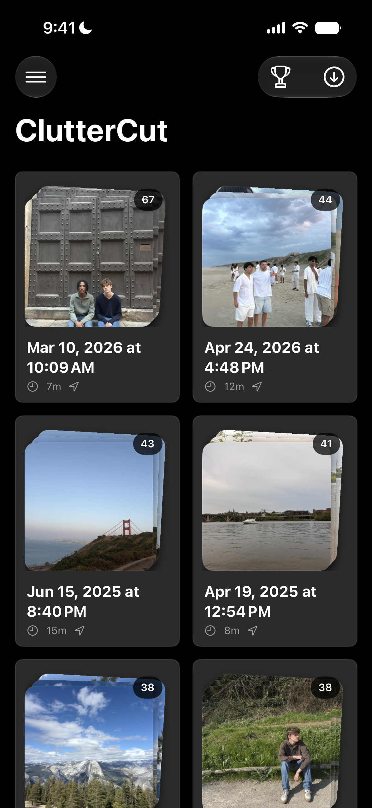
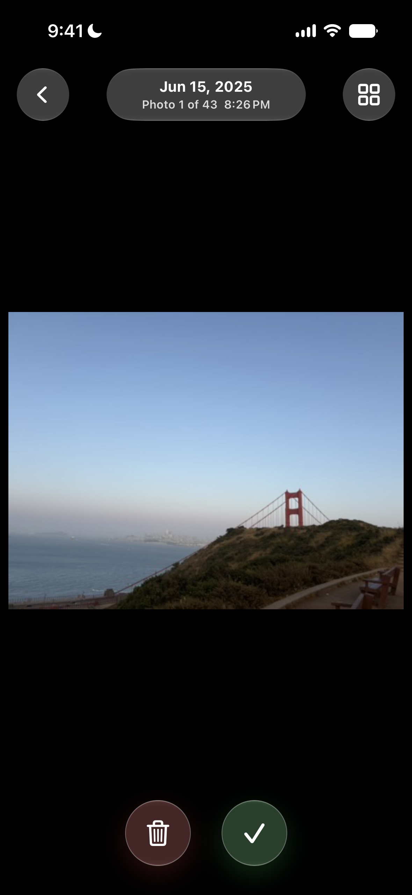
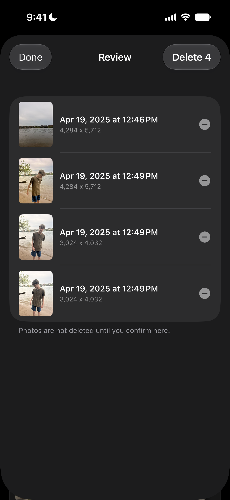
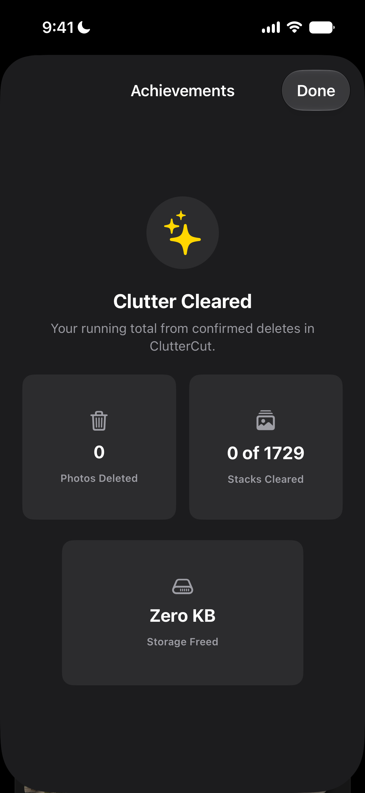

## Clutter Cut

Clutter cut is an app dedicated to removing similar duplicates of photos in your library.

So many people take a million photos of the same thing and end up with a bloated camera roll.

Clutter cut groups photos together based on time taken and location and puts them into stacks easily allowing you to go through and remove all but the best photos for each stack.

## Screenshots
<table>
<tr>
<td align="center"></td>
<td align="center"></td>
<td align="center"></td>
<td align="center"></td>
<td align="center"></td>
</tr>
<tr>
<td align="center">Home</td>
<td align="center">Media Viewer</td>
<td align="center">Swipe Selector</td>
<td align="center">Review</td>
<td align="center">Achievements</td>
</tr>
</table>

## App Development
- Built with Swift and SiftUI.
- Used the PhotoKit API for accessing and managing the photo library.

ClutterCut is currently under development.
